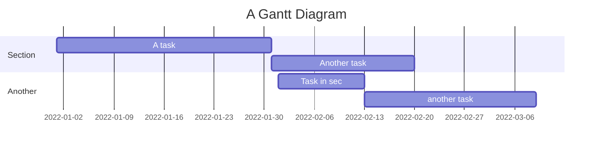

# MermaidGantt

MermaidGantt is a tool to convert Mermaid Gantt chart format to Plotly Gantt charts.

## Installation

1. Install Poetry if you haven't already:
```sh
pip install poetry
```

2. Clone the repository and navigate to the project directory:
```sh
git clone https://github.com/yourusername/mermaid_gantt
cd mermaid_gantt
```

3. Install the dependencies:
```sh
poetry install
```

## Usage


## Contributing

Contributions are welcome! Please feel free to open an issue or submit a pull request.

## License

This project is licensed under the MIT License. See the [LICENSE](LICENSE) file for details.
```

# Mermaid Gantt chart

